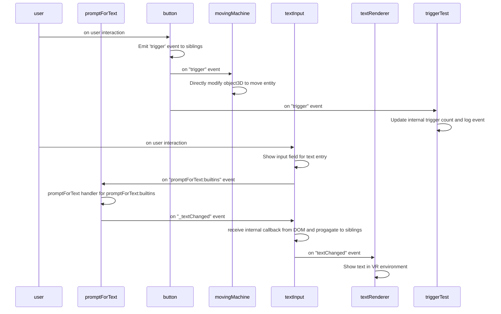

# A-Frame Machines

## Overview

This repository provides an aframe component called `a-machine` which makes it easy to build interactive objects in virtual reality, often in a no-code manner.
These machine components can listen for events from each other or the user, can emit events, or update some internal state. This allows them to achieve very complex behavior.
While defining custom machines is supported and encouraged, a number of prebuilt machines are provided to enable a lot of functionality without knowing anything about programming.
This repository also provides a utility that parses a set of machine definitions and graphs their interdependcies as a mermaidjs sequence diagram. This can be useful for evaluating how machines might work in parallel, which is necessary for building highly-composable machinery.

## Default machines

These machines are currently available out of the box. All of these are a work in progress and subject to change.

- `button`: Emits a `trigger` event to its siblings. Useful for invoking a callback on a machine without interacting with it directly.
- `textInput`: Emits an event that prompts the user for text input. When the user submits the text, an callback event is sent to the `textInput` machine and distributed to its siblings. **NOTE**: Using this machine in its default settings requires adding a DOM overlay to your WebXR instance.
- `triggerTest`: Subscribes to `trigger` events and generates a console log. Useful for testing that custom `trigger` machines are working correctly.
- `textRenderer`: Subscribes to the event emitted by `textInput` machines when text is updated. Sets the `text.value` attribute of the a-frame entity.
- `movingMachine`: Subscribes to `trigger` events and modifies the position of the a-frame entity according to user-set properties.

## Building machines in the DOM

Here's a simple example of a machine. It has a box that, when clicked, emits an event that causes all of its direct siblings to move.

```html
<a-scene>
  <a-entity id="machine-wrapper">
    <a-box position="-1 0 0" color="blue" a-machine="machine: button">
    <!-- These two machines will move when the button machine is clicked since they are siblings of the button -->
    <a-box position="0 0 0" color="red" a-machine="machine: movingMachine">
    <a-box position="1 0 0" color="orange" a-machine="machine: movingMachine">
  </a-entity>
  <!-- This machine will not move when the button is clicked because it is not the button's sibling -->
  <a-box position="3 0 0" color="cyan" a-machine="machine: movingMachine">
</a-scene>
```

For more examples, see this repository's `index.html` file.

## Generating sequence diagrams

Once all machines and built-ins have been registered, call `graphMachines(Object.values(machineRegistry))`. See `main.ts` for details.
Here is the default graph.



## Writing custom machines

Let's look at the `button` machine as an example:

```javascript
export const buttonMachine: IMachine = {
  name: "button",
  listeners: {
    interact: (event: any, state: Record<string, any>, emit: Function) => {
      emit("trigger")
    }
  },
  metadata: {
    interact: {
      description: "Emit 'trigger' event to siblings"
    }
  },
  canEmit: ["trigger"]
}
```

- The `name` property is used when adding setting the `a-machine.machine` attribute in the DOM. It should be unique.
- The `listeners` property contains an arbitrary number of functions. The function name indicates the event that will trigger each listener. Each listener receives the event that triggered it, the internal state of the listener, and a function for emitting new events.
- The `metadata` property holds descriptions for each event listener. These are used in the sequence diagram.
- The `canEmit` array holds all the events that the listeners are allowed to emit. **NOTE**: This property is highly likely to change in the future so the permitted events can be defined on a per-listener basis.
